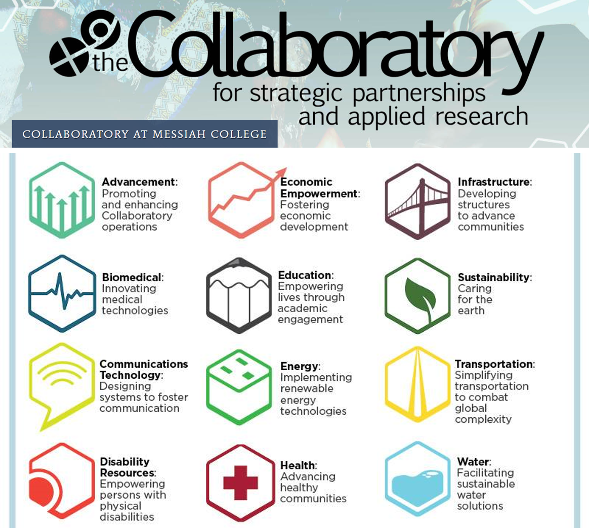

class: inverse middle center big-subsection

```{r setup, include=FALSE, warning = FALSE}
knitr::opts_chunk$set(
  fig.width = 10, 
  fig.height = 5,
  fig.align = "center",
  echo = FALSE)
require(ggiraphExtra)
require(moonBook)
library(mosaic)
library(ggformula)
library(gifski)
require(plotly)

theme_set(theme_bw(base_size = 26))

survey <- read.csv('data/s245-survey.csv')
hours_dir <- "C:/Users/Stacy DeRuiter/Dropbox/CalvinTeaching/STAT245/Fall2019/Projects/"
hours19 <- readr::read_csv(paste(hours_dir, "service-learning-hours.csv", sep = ''))
hours19 <- hours19 %>%
  mutate(date = lubridate::mdy_hm(StartDate)) %>%
  filter(date >= lubridate::mdy_hms('8/31/2019 12:00:00'))
hours19 <- hours19 %>% group_by(Q1) %>%
  summarize(total_hours = sum(Q2_1, na.rm = TRUE))
```

# Motivation

---

# Guidelines and Goals 

<br>

<p class="aligncenter">


</p>


<br>
## Real data, Statistical software, Problem-solving, Decision-making, Diversity, Communication

---

# Service Learning at Calvin University

<br>

<p class="aligncenter">


</p>

<https://calvin.edu/offices-services/service-learning-center>

---

# Statistics Without Borders <https://swb.wildapricot.org/>

<div style="text-align:center;">
<video width="800" height="450" autoplay controls muted>
  <source src="images/swb_1_intro.mp4" type="video/mp4">
</video>
</div>

### Meeting today, 17:00: <https://swb.wildapricot.org/event-3889685>
---

# STAT 245: Advanced Data Analysis
## A.K.A.: Applied Regression; or, GLMs & Friends
<br>

```{r, echo = FALSE, out.width = '800px', fig.height = 3, fig.width = 9}
fit4=lm(NTAV~age*weight*HBP,data=radial)
ggPredict(fit4,interactive = FALSE) + 
  scale_color_distiller('Weight', palette = 'Reds') + 
  scale_fill_continuous(guide=FALSE) + 
  xlab('Age') + ylab('Atherosclerosis')
```

<br>
Thanks to: 
<https://cran.r-project.org/web/packages/ggiraphExtra>

---

# Applied Regression; or, GLMs & Friends
<br>

<p class="aligncenter">

<!--  -->
</p>

<!-- <p class="aligncenter"> -->
<!--  -->
<!--  -->
<!-- </p> -->

<br>
<br>
<br>
<br>
<br>
*images: mfviz.com/hierarchical-models, knowledgebase.aridhia.com/article/logistic-regression/*

---

# Applied Regression; or, GLMs & Friends
<br>

<p class="aligncenter">

</p>

<!-- <p class="aligncenter"> -->
<!--  -->
<!--  -->
<!-- </p> -->

<br>
<br>
<br>
<br>
<br>
*images: mfviz.com/hierarchical-models, knowledgebase.aridhia.com/article/logistic-regression/*

---

# Applied Regression; or, GLMs & Friends
<br>

<p class="aligncenter">

</p>

<p class="aligncenter">

<!--  -->
</p>

<br>
*images: mfviz.com/hierarchical-models, knowledgebase.aridhia.com/article/logistic-regression/*
---

# Applied Regression; or, GLMs & Friends
<br>

<p class="aligncenter">

</p>

<p class="aligncenter">


</p>

<br>
*images: mfviz.com/hierarchical-models, knowledgebase.aridhia.com/article/logistic-regression/*
---

## Statistical Consultancy as Service Learning


---

# More (Global) Project partners
<br><br>

<p>


</p>

<br><br>
# Join us? sld33@calvin.edu

*world icon: thenounproject.com*
---

# Project Structure 1.0

<br>

<p class="aligncenter">

</p>

<br>
*icon: flaticon.com*

---
# Project Structure 1.0: Oops.

<br> 

<p class="aligncenter">


</p>

<br>
<br>
<br>
*icons: flaticon.com, vectorstock.com, icon-library.com*

---
# Project Structure 2.0

---
class: inverse middle center big-subsection
# ? + ? + ?
---

# Project Structure 2.0: Three Key Questions
<br>
<p class="aligncenter">


</p>

- Annotated Bibliography
- Tidy Dataset
- Pretty Figures
- Regression Model (rationale, results, figures, interpretation)
- Interactive map or app

<br>
*icons: thenounproject.com, measureevaluation.org, mfviz.com/hierarchical-models*
---
class: inverse middle center big-subsection

# Student Investment
---

# Student Time Investment (Fall 2019)

## Goal: 40 hours or 4-5 hours per week
<br>

```{r, echo = FALSE}
gf_dhistogram(~total_hours, data = hours19, 
             binwidth = 5,
             xlab = 'Total Hours Worked per Student',
             ylab = 'Density')
```
---
# Student Survey (n = 9, or 33%)

- need to fill in results and details here

*Research approved by Calvin University IRB*

---
# Partner Survey (n = 7, or 50%)

- need to fill in results and details here

*Research approved by Calvin University IRB*


---

<iframe src="https://embed.polleverywhere.com/free_text_polls/gv2F355r6IJ7S9F44XRPW?controls=none&short_poll=true" width="800" height="600" frameBorder="0"></iframe>
---

<iframe src="https://embed.polleverywhere.com/free_text_polls/SURRL1huNvDApz8YnI8Gn?controls=none&short_poll=true" width="800" height="600" frameBorder="0"></iframe>
---
# Similar Initiatives

## This session!
<p class="aligncenter">


</p>


---
# Conclusions and Perspectives
<br>
- Projects are wonderful
- It’s not (too) hard to mastermind

<br>
###...BUT
<br>

- Student engagement?
- Value for partner organizations?

---
## Thank You!

<iframe src="https://player.vimeo.com/video/282862249?autoplay=1&title=0&byline=0&portrait=0&muted=1" width="640" height="338" frameborder="0" allow="autoplay; fullscreen" allowfullscreen></iframe>

### Contact Stacy DeRuiter
### Email: sld33@calvin.edu
### Twitter: @slderuiter


