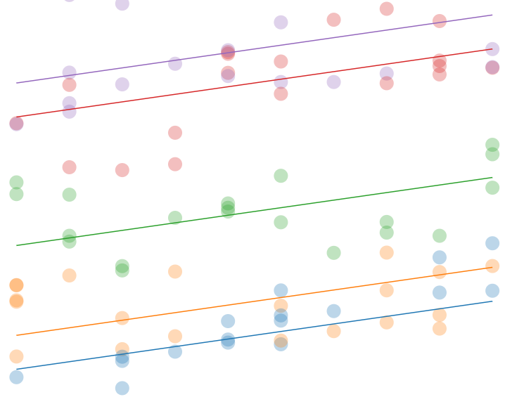

class: inverse middle center big-subsection

```{r setup, include=FALSE}
knitr::opts_chunk$set(
  fig.width = 10, 
  fig.height = 3,
  fig.align = "center",
  echo = FALSE)
require(ggiraphExtra)
require(moonBook)
library(mosaic)
library(ggformula)
library(gifski)
require(plotly)

theme_set(theme_bw(base_size = 16))
```

# Motivation

---

# Guidelines and Goals 

<br>

<p class="aligncenter">


</p>


<br>
## Real data, Statistical software, Problem-solving, Decision-making, Diversity, Communication

---

# Service Learning at Calvin University

<br>

<p class="aligncenter">


</p>

<https://calvin.edu/offices-services/service-learning-center>

---

# Statistics Without Borders <https://swb.wildapricot.org/>

<div style="text-align:center;">
<video width="800" height="450" autoplay controls muted>
  <source src="images/swb_1_intro.mp4" type="video/mp4">
</video>
</div>

### Meeting today, 17:00: <https://swb.wildapricot.org/event-3889685>
---

# STAT 245: Advanced Data Analysis
## A.K.A.: Applied Regression; or, GLMs & Friends
<br>

```{r, echo = FALSE, out.width = '800px', fig.height = 3, fig.width = 9}
fit4=lm(NTAV~age*weight*HBP,data=radial)
ggPredict(fit4,interactive = FALSE) + 
  scale_color_distiller('Weight', palette = 'Reds') + 
  scale_fill_continuous(guide=FALSE) + 
  xlab('Age') + ylab('Atherosclerosis')
```

<br>
Thanks to: 
<https://cran.r-project.org/web/packages/ggiraphExtra>

---

# STAT 245: Advanced Data Analysis
## A.K.A.: Applied Regression; or, GLMs & Friends

<p class="aligncenter">

</p>

---

# STAT 245: Advanced Data Analysis
## A.K.A.: Applied Regression; or, GLMs & Friends

<p class="aligncenter">


</p>

---

# STAT 245: Advanced Data Analysis
## A.K.A.: Applied Regression; or, GLMs & Friends

<p class="aligncenter">


</p>

<p>

</p>

---

# STAT 245: Advanced Data Analysis
## A.K.A.: Applied Regression; or, GLMs & Friends

<p class="aligncenter">

</p>

<p>


</p>

---

## Statistical Consultancy as Service Learning

---
# Project Partners


---

# Project partners
<br><br>

<p>


</p>

<br><br>
# Join us? sld33@calvin.edu
---


## Thank You!

<iframe src="https://player.vimeo.com/video/282862249?autoplay=1&title=0&byline=0&portrait=0&muted=1" width="640" height="338" frameborder="0" allow="autoplay; fullscreen" allowfullscreen></iframe>

### Contact Stacy DeRuiter
### Email: sld33@calvin.edu
### Twitter: @slderuiter


