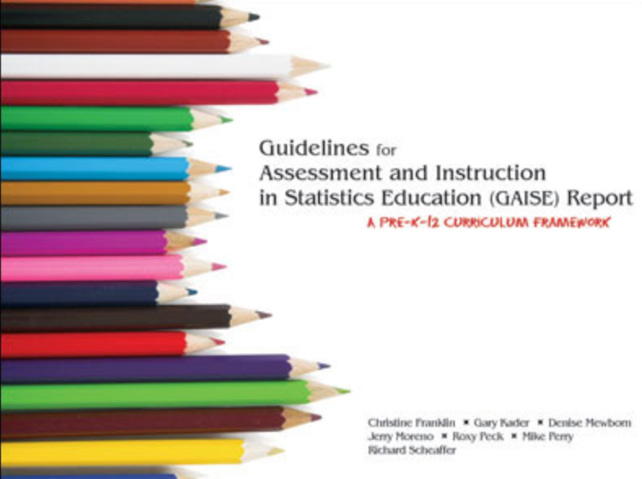
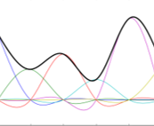
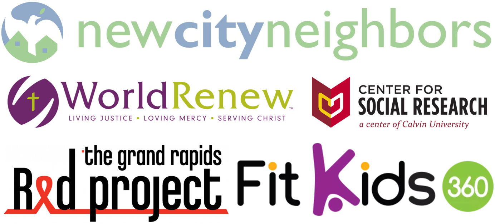

class: inverse middle center big-subsection

```{r setup, include=FALSE, warning = FALSE}
knitr::opts_chunk$set(
  fig.width = 10, 
  fig.height = 5,
  fig.align = "center",
  echo = FALSE)
require(ggiraphExtra)
require(moonBook)
require(tidyverse)
library(mosaic)
library(ggformula)
library(gifski)
require(plotly)

theme_set(theme_bw(base_size = 26))

require(qualtRics)
whole_survey <- read_survey('data/s245-survey.csv') %>%
  mutate(person = case_when(Q3 == "A Project Partner. I (and/or my organization) provided data, analysis goals, and support to student researchers." ~ 'partner',
                            Q3 == "A Student. I worked on a project as part of my STAT 245 coursework."  ~ 'student',
                            TRUE ~ 'unknown'))

students <- whole_survey %>%
  dplyr::filter(person == 'student') %>%
  rename(partner_logistics = Q10_1,
         partner_expectations = Q10_2,
         group_comm = Q10_3,
         group_logistics = Q10_4,
         effective_group_work = Q10_5,
         rewarding = Q12,
         frustrating = Q13,
         understand_context = Q11_1,
         formulate_qs = Q11_2,
         get_data = Q11_3,
         tidying = Q11_4,
         figures = Q11_5,
         tables = Q11_6,
         models = Q11_7,
         interp = Q11_8,
         most_valuable = Q14,
         course_more_enjoy = Q16_1,
         course_more_difficult = Q16_2,
         contrib_learning = Q16_3,
         liked_giving_back = Q16_4,
         useful_to_partner = Q16_5,
         what_to_change = Q15)

students_lik <- students %>%
  select(-rewarding, -most_valuable, -contrib_learning, - what_to_change, -frustrating) %>%
  select(person, partner_logistics : useful_to_partner) %>%
  pivot_longer(-person, names_to = "question", values_to = "response") %>%
  mutate(response = case_when(response == 'Extremely easy' ~ '0',
                              response == 'Somewhat easy' ~ '1',
                              response == 'Neither easy nor difficult' ~ '2',
                              response == 'Somewhat difficult' ~ '3',
                              response == 'Extremely difficult' ~ '4',
                              response == 'Strongly disagree' ~ '0',
                              response == 'Somewhat disagree' ~ '1',
                              response == 'Neither agree nor disagree' ~ '2',
                              response == 'Somewhat agree' ~ '3',
                              response == 'Strongly agree' ~ '4',
                              TRUE ~ 'not a number')) %>%
  mutate(response = parse_number(response)) %>%
  group_by(question) %>%
  summarize(mean = mean(response, na.rm = TRUE) %>%
              round(digits = 2),
            median = median(response, na.rm = TRUE)) %>%
  ungroup()

# pal to use: RdYlGn inverted

partners <- survey %>%
  filter(person == 'partner')


hours_dir <- "C:/Users/Stacy DeRuiter/Dropbox/CalvinTeaching/STAT245/Fall2019/Projects/"
hours19 <- readr::read_csv(paste(hours_dir, "service-learning-hours.csv", sep = ''))
hours19 <- hours19 %>%
  mutate(date = lubridate::mdy_hm(StartDate)) %>%
  filter(date >= lubridate::mdy_hms('8/31/2019 12:00:00'))
hours19 <- hours19 %>% group_by(Q1) %>%
  summarize(total_hours = sum(Q2_1, na.rm = TRUE))
```

# Motivation

---

# Guidelines and Goals 

<br>

<p class="aligncenter">



</p>


<br>
## Real data, Statistical software, Problem-solving, Decision-making, Diversity, Communication

---

# Service Learning at Calvin University

<br>

<p class="aligncenter">


</p>

<https://calvin.edu/offices-services/service-learning-center>

---

# Statistics Without Borders <https://swb.wildapricot.org/>

<div style="text-align:center;">
<video width="800" height="450" autoplay controls muted>
  <source src="images/swb_1_intro.mp4" type="video/mp4">
</video>
</div>

### Meeting today, 17:00: <https://swb.wildapricot.org/event-3889685>
---

# STAT 245: Advanced Data Analysis
## A.K.A.: Applied Regression; or, GLMs & Friends
<br>

```{r, echo = FALSE, out.width = '800px', fig.height = 3, fig.width = 9}
fit4=lm(NTAV~age*weight*HBP,data=radial)
ggPredict(fit4,interactive = FALSE) + 
  scale_color_distiller('Weight', palette = 'Reds') + 
  scale_fill_continuous(guide=FALSE) + 
  xlab('Age') + ylab('Atherosclerosis')
```

<br>
Thanks to: 
<https://cran.r-project.org/web/packages/ggiraphExtra>

---

# Applied Regression; or, GLMs & Friends
<br>

<p class="aligncenter">

<!--  -->
</p>

<!-- <p class="aligncenter"> -->
<!--  -->
<!--  -->
<!-- </p> -->

<br>
<br>
<br>
<br>
<br>
*images: mfviz.com/hierarchical-models, knowledgebase.aridhia.com/article/logistic-regression/*

---

# Applied Regression; or, GLMs & Friends
<br>

<p class="aligncenter">

</p>

<!-- <p class="aligncenter"> -->
<!--  -->
<!--  -->
<!-- </p> -->

<br>
<br>
<br>
<br>
<br>
*images: mfviz.com/hierarchical-models, knowledgebase.aridhia.com/article/logistic-regression/*

---

# Applied Regression; or, GLMs & Friends
<br>

<p class="aligncenter">

</p>

<p class="aligncenter">

<!--  -->
</p>

<br>
*images: mfviz.com/hierarchical-models, knowledgebase.aridhia.com/article/logistic-regression/*
---

# Applied Regression; or, GLMs & Friends
<br>

<p class="aligncenter">

</p>

<p class="aligncenter">


</p>

<br>
*images: mfviz.com/hierarchical-models, knowledgebase.aridhia.com/article/logistic-regression/*
---

## Statistical Consultancy as Service Learning


---

# More (Global) Project partners
<br><br>

<p>


</p>

<br><br>
# Join us? sld33@calvin.edu

*world icon: thenounproject.com*
---

# Project Structure 1.0

<br>

<p class="aligncenter">

</p>

<br>
*icon: flaticon.com*

---
# Project Structure 1.0: Oops.

<br> 

<p class="aligncenter">


</p>

<br>
<br>
<br>
*icons: flaticon.com, vectorstock.com, icon-library.com*

---
# Project Structure 2.0

---
class: inverse middle center big-subsection
# ? + ? + ?
---

# Project Structure 2.0: Three Key Questions
<br>
<p class="aligncenter">


</p>

- Annotated Bibliography
- Tidy Dataset
- Pretty Figures
- Regression Model (rationale, results, figures, interpretation)
- Interactive map or app

<br>
*icons: thenounproject.com, measureevaluation.org, mfviz.com/hierarchical-models*
---
class: inverse middle center big-subsection

# Student Investment
---

# Student Time Investment (Fall 2019)

## Goal: 40 hours or 4-5 hours per week
<br>

```{r, echo = FALSE}
gf_dhistogram(~total_hours, data = hours19, 
             binwidth = 5,
             xlab = 'Total Hours Worked per Student',
             ylab = 'Density')
```

---
# Student Survey (n = 9, or 33%)
## Projects made the course...

```{r, echo = FALSE, fig.width = 10, fig.height = 3.5}
s1 <- students_lik %>%
  filter(question %in% c('course_more_difficult', 
                         'course_more_enjoy',
                         'useful_to_partner',
                         'liked_giving_back')) %>%
  mutate(question = case_when(question == 'course_more_difficult' ~ "More Difficult",
                              question == 'course_more_enjoy' ~ "More Enjoyable",
                              question == 'useful_to_partner' ~ 'Useful to Partner',
                              question == 'liked_giving_back' ~ 'Liked Giving Back',
                              TRUE ~ ' '))
theme_set(theme_void(base_size = 28))

gf_rect(0 + 4 ~ 1 + 2,
        color = 'grey44', data = s1) %>%
  gf_rect(0 + mean ~ 1 + 2, data = s1,
          fill = ~mean)   %>%
  gf_theme(scale_fill_distiller(palette = 'RdYlGn', direction = 1, limits = c(0,4)),
           scale_color_distiller(palette = 'RdYlGn', direction = 1, limits = c(0,4)),
           strip.background = element_blank()
           ) %>%
  gf_text(0 ~ 0, label = ~mean, color = 'grey44', size = 10) %>%
  gf_refine(coord_polar(theta = "y", start = -pi/2),
            guides(fill = FALSE, color = FALSE)) %>%
  gf_lims(x = c(0, 2), y = c(0,8)) %>% 
  gf_facet_wrap(~question, nrow = 1)
  
```
---

# Students: Assessment of Group Work


```{r, echo = FALSE, out.width='98%'}
s2 <- students_lik %>%
  filter(question %in% c('group_logistics', 
                         'group_comm',
                         'effective_group_work')) %>%
  mutate(question = case_when(question == 'group_logistics' ~ "Logistics",
                              question == 'group_comm' ~ "Communication",
                              question == 'effective_group_work' ~ 'Overall Effectiveness',
                              TRUE ~ ' '))
theme_set(theme_void(base_size = 28))

gf_rect(0 + 4 ~ 1 + 2,
        color = 'grey44', data = s2) %>%
  gf_rect(0 + mean ~ 1 + 2, data = s2,
          fill = ~mean)   %>%
  gf_theme(scale_fill_distiller(palette = 'RdYlGn', direction = 1, limits = c(0,4)),
           scale_color_distiller(palette = 'RdYlGn', direction = 1, limits = c(0,4)),
           strip.background = element_blank(),
           #strip.text.x = element_blank(),
           #strip.text = element_text(size = 30)
           base_size = 100
           ) %>%
  gf_text(0 ~ 0, label = ~mean, color = 'grey44', size = 10) %>%
  gf_refine(coord_polar(theta = "y", start = -pi/2),
            guides(fill = FALSE, color = FALSE)) %>%
  gf_lims(x = c(0, 2), y = c(0,8)) %>% 
  gf_facet_wrap(~question)
  
```

---


# Students: Difficulty of Tasks

```{r, echo = FALSE, fig.width = 10, fig.height = 9}
s3 <- students_lik %>%
  filter(question %in% c('understand_context',
                         'formulate_qs',
                         'tidying',
                         'figures',
                         'tables',
                         'models',
                         'interp')) %>%
  mutate(question = factor(case_when(question == 'understand_context' ~ "Context",
                              question == 'formulate_qs' ~ "Questions",
                              question == 'tidying' ~ 'Tidy Data',
                              question == 'figures' ~ 'Figures',
                              question == 'tables' ~ 'Tables',
                              question == 'models' ~ 'Models',
                              question == 'interp' ~ 'Interpretation',
                              TRUE ~ ' '))) %>%
  mutate(question = forcats::fct_relevel(question,
                                         "Context",
                                         'Questions',
                                         'Tidy Data',
                                         'Figures',
                                         'Tables',
                                         'Models',
                                         'Interpretation'))
gf_rect(0 + 4 ~ 1 + 2,
        color = 'grey44', data = s3) %>%
  gf_rect(0 + mean ~ 1 + 2,
          fill = ~mean)   %>%
  gf_theme(scale_fill_distiller(palette = 'RdYlGn', direction = -1, limits = c(0,4)),
           scale_color_distiller(palette = 'RdYlGn', direction = -1, limits = c(0,4)),
           strip.background = element_blank(),
           #strip.text.x = element_blank(),
           #strip.text = element_text(size = 30)
           base_size = 100
           ) %>%
  gf_text(0 ~ 0, label = ~mean, color = 'grey44', size = 10) %>%
  gf_refine(coord_polar(theta = "y", start = -pi/2),
            guides(fill = FALSE, color = FALSE)) %>%
  gf_lims(x = c(0, 2), y = c(0,8)) %>% 
  gf_facet_wrap(~question, nrow = 2)
  
```


<!-- *Research approved by Calvin University IRB* -->

---
# Partner Survey (n = 7, 50%)

- need to fill in results and details here

*Research approved by Calvin University IRB*


---

<iframe src="https://embed.polleverywhere.com/free_text_polls/gv2F355r6IJ7S9F44XRPW?controls=none&short_poll=true" width="800" height="600" frameBorder="0"></iframe>
---

<iframe src="https://embed.polleverywhere.com/free_text_polls/SURRL1huNvDApz8YnI8Gn?controls=none&short_poll=true" width="800" height="600" frameBorder="0"></iframe>
---
# Similar Initiatives

## This session! 
### Purdue University StatCom (Andrew Thomas)
### Cal State Monterey Bay (Alana Unfried)
### Jefferson Comm. College Ctr. Community Studies (Joel LaLone)

<p class="aligncenter">


</p>


---
# Conclusions and Perspectives
<br>
- Projects yield 
  - motivation + struggle
  - success if viz and models *communicate clearly*
  - big-picture thinking
  - connections across the curriculum
- It’s not (too) hard to mastermind

###...BUT

- Student engagement?
- Value for partner organizations?
- How can we turn time limitation into an asset?

---
## Thank You!

<iframe src="https://player.vimeo.com/video/282862249?autoplay=1&title=0&byline=0&portrait=0&muted=1" width="640" height="338" frameborder="0" allow="autoplay; fullscreen" allowfullscreen></iframe>

### Contact Stacy DeRuiter
### Email: sld33@calvin.edu
### Twitter: @slderuiter


